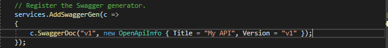
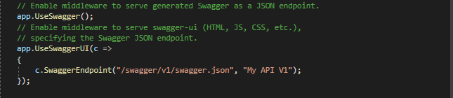
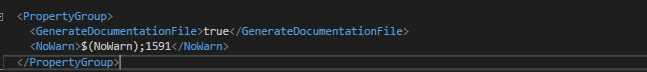
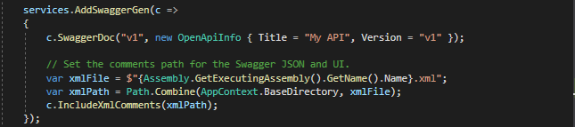
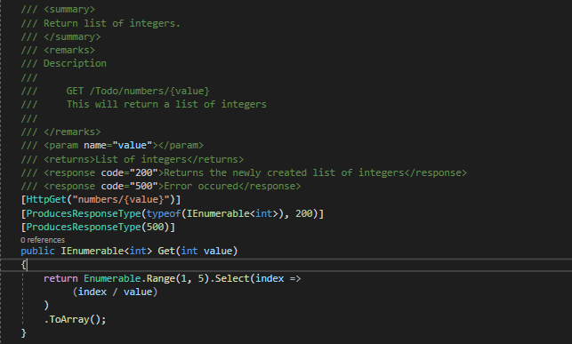
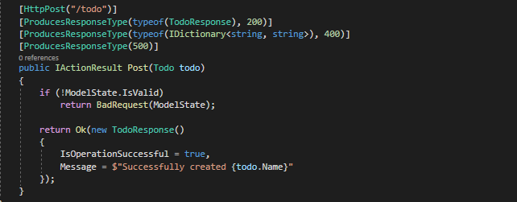
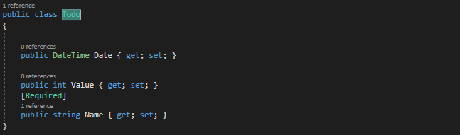
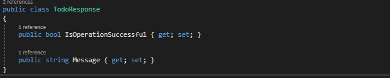
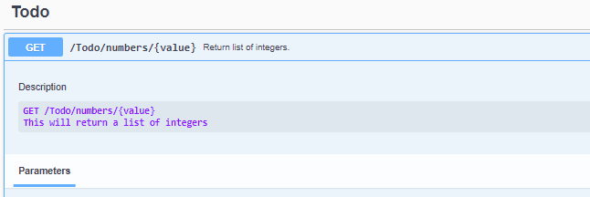
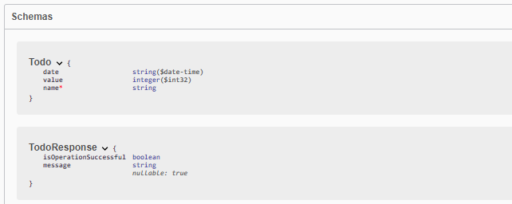

# dotnetcore3.1_swagger

## Used Technologies

1. dotnetcore 3.1

## Quick Started

1. Checkout the code.
2. Open a cmd inside the 'Swagger' folder where you cloned the code.
3. Run 'dotnet run --project ./Swagger.csproj' or 'dotnet run'
4. Open a browser and type 'https://localhost:5001/swagger/index.html'.

## Getting Started

Create a web api project and install following package.

Register swagger generator in the 'ConfigureServices' method by adding following. Add the following using statement 'using Microsoft.OpenApi.Models'. 

Then enable the middleware for serving the generated JSON document and the Swagger UI by adding following in 'Configure' method.

At this point minimum requirement is there for swagger. Remove IIS profile from 'launchSettings.json' and run the application then navigate to 'https://localhost:5001/swagger/index.html'.

## Enable XML Comments

XML comments alllows to add additional details such as description to swagger end points.
Before get in to that add TodoController.cs, TodoModel.cs and TodoResponse.cs at root level.
Next right click and select edit the 'Swagger.csproj' and add following to it. This eanble Swashbuckle to incorporate those comments into the output Swagger JSON.
Purpose of '<NoWarn>$(NoWarn);1591</NoWarn>' is to suppress warnings of classes or methods that are NOT annotated with XML comments from generating build warnings.

After that add following to the ConfigureServices method. This adds xml file. XML file is mandatory for most of the features, namely method summaries and the descriptions of parameters and response codes. Reflection is used to build an XML file name matching that of the web API project. The AppContext.BaseDirectory property is used to construct a path to the XML file. 

Then add following to TodoController.cs file. In swagger, the one with the xml comments displays additional data while the other displays default information.

Next add following to TodoModel.cs. There the required attribute will automatically flag as a "required" parameter in the generated Swagger.

Finally create the TodoResponce.cs with following.

Run the app again and have look at the swagger end points. There will be additiona description like this.

Look Swagger schema, Todo model have the required property flagged as well.

